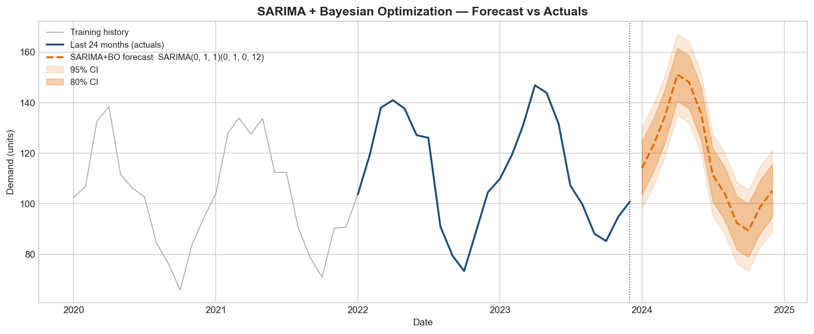

# boa-sarima-forecaster

> Demand forecasting at any frequency using ARIMA + Bayesian Optimisation (Optuna TPE)


---

## Table of Contents

1. [Motivation](#motivation)
2. [Methodology](#methodology)
3. [Results](#results)
4. [Project Structure](#project-structure)
5. [Installation](#installation)
6. [Quick Start](#quick-start)
7. [Input Data Format](#input-data-format)
8. [Configuration](#configuration)
9. [Running the Demo Notebook](#running-the-demo-notebook)
10. [Output Files](#output-files)
11. [License](#license)

---

## Motivation

Demand planners managing hundreds of SKUs across multiple markets face a
recurring problem: **fitting time-series models at scale requires choosing
hyperparameters** (the ARIMA orders p, d, q) that differ by product and
country.  Manual tuning is infeasible, and brute-force grid search over all
possible combinations is computationally expensive.

This library addresses the problem with **Bayesian Optimisation** — a
principled, sample-efficient search strategy that learns from past
evaluations to focus on promising parameter regions.  The result is a
production-ready pipeline that:

- Automatically finds the best ARIMA order per time series.
- Handles intermittent demand, trend, and mild seasonality.
- Clips outliers via a weighted moving-average smoother.
- Scales to hundreds of SKUs via parallel execution.

---

## Methodology

The pipeline consists of five stages:

### 1 — Data Preparation

Raw sales data is loaded from Excel (see [Input Data Format](#input-data-format)),
cleaned (NaN fill, invalid-row removal, date parsing), and preprocessed
(zero-series removal, missing-month fill, optional representative-SKU
consolidation).

### 2 — Outlier Standardisation

A weighted moving-average smoother clips each observation to ±2.5σ of its
neighbourhood (configurable via `sigma_threshold`), generating an
`adjusted_value` column alongside the raw demand.  Both columns are modelled
independently; the one with the lower optimisation score is used for the final
forecast.

### 3 — Bayesian Optimisation (Optuna TPE)

The **Tree-structured Parzen Estimator (TPE)** searches the integer space
`p ∈ [0, 6], d ∈ [0, 2], q ∈ [0, 6]` (147 combinations) to minimise
the hybrid cost function:

```
combined = 0.7 × sMAPE + 0.3 × RMSLE
```

The TPE sampler:
- Uses `multivariate=True` to capture correlations between p and q.
- Is seeded at `seed=42` for reproducibility.
- Is warm-started with `ARIMA(1,1,1)` and `AR(1)` to accelerate convergence.

### 4 — SARIMA Forecasting

The best `(p, d, q)` found by the optimiser is used to fit a full SARIMA
model via `statsmodels.SARIMAX`.  The model generates a 12-month point
forecast with 95 % confidence intervals.  Negative predictions are clipped
to zero.

### 5 — Parallel Execution

The per-SKU loop is parallelised with `joblib.Parallel(backend="loky")`,
enabling all available CPU cores to be utilised. The `loky` backend uses
separate processes, which is better suited for CPU-bound tasks like SARIMA
fitting. <!-- Changed from "threading" to "loky" — better for CPU-bound tasks (SARIMA fitting) -->

For a deeper technical description, see [`docs/methodology.md`](docs/methodology.md).

---

## Results



The chart above shows the SARIMA+BO model trained on 48 months of synthetic monthly demand data, with a 12-month point forecast and 80%/95% confidence interval bands.

### Model comparison (synthetic demo data)

| Model          | sMAPE (%) | RMSLE | beats_naive |
|----------------|-----------|-------|-------------|
| SARIMA+BO      | 8.4       | 0.09  | True        |
| ETS            | 10.2      | 0.11  | True        |
| Seasonal Naïve | 14.7      | 0.16  | —           |

> **Note:** Values are from synthetic demo data generated with `data/sample_data.csv`. Results on real production data will vary.

---

## Project Structure

```
boa-sarima-forecaster/
├── README.md
├── requirements.txt
├── pyproject.toml
├── .gitignore
├── config.example.yaml          ← copy to config.yaml and customise
│
├── src/
│   └── sarima_bayes/
│       ├── __init__.py          ← public API re-exports
│       ├── config.py            ← global constants
│       ├── data_loader.py       ← Excel ingestion and cleaning
│       ├── preprocessor.py      ← date fill, zero removal, SKU consolidation
│       ├── standardization.py   ← weighted moving-average outlier clipping
│       ├── metrics.py           ← sMAPE, RMSLE, combined_metric
│       ├── optimizer.py         ← Bayesian Optimisation (Optuna TPE)
│       └── model.py             ← SARIMA fitting and forecast generation
│
├── data/
│   ├── README.md                ← data format specification
│   ├── sample_data.csv          ← synthetic demo data (safe to commit)
│   ├── input/                   ← put your real Excel files here (git-ignored)
│   └── output/                  ← forecast results written here (git-ignored)
│
├── notebooks/
│   └── demo.ipynb               ← end-to-end demonstration notebook
│
└── docs/
    └── methodology.md           ← detailed technical explanation
```

---

## Installation

### Option 1 — pip (recommended)

```bash
# Clone the repository
git clone https://github.com/TomCardeLo/boa-sarima-forecaster
cd boa-sarima-forecaster

# Create and activate a virtual environment
python -m venv .venv
source .venv/bin/activate      # Linux / macOS
.venv\Scripts\activate         # Windows

# Install all dependencies
pip install -r requirements.txt

# Install the package in editable mode (enables `from sarima_bayes import ...`)
pip install -e .
```

### Option 2 — notebook only (no install)

The demo notebook adds `src/` to `sys.path` automatically, so you can run
it without a full install:

```bash
pip install -r requirements.txt
jupyter notebook notebooks/demo.ipynb
```

---

## Quick Start

```python
import numpy as np
from sarima_bayes import optimize_arima, forecast_arima

# Example: 36 months of synthetic monthly demand
rng = np.random.default_rng(42)
series = 100 + np.cumsum(rng.normal(0, 5, 36))   # random walk around 100

# Step 1 — find the best ARIMA(p, d, q) order
best_params, score = optimize_arima(
    series=series,
    p_range=(0, 4),
    d_range=(0, 2),
    q_range=(0, 4),
    n_calls=30,        # number of Bayesian trials
    n_jobs=1,
)
print(f"Best order: {best_params}  |  Score: {score:.4f}")
# Example output: Best order: {'p': 1, 'd': 1, 'q': 0}  |  Score: 5.2348

# Step 2 — generate a 12-month forecast
import pandas as pd
dates = pd.date_range("2022-01", periods=36, freq="MS")
df = pd.DataFrame({"Date": dates, "CS": series})

result = forecast_arima(
    bd=df,
    col_x="Date",
    col_y="CS",
    p=best_params["p"],
    d=best_params["d"],
    q=best_params["q"],
    n_per=12,
    country="US",
    sku=1001,
    freq="MS",   # "W" for weekly, "D" for daily, "h" for hourly
)
print(result)
```

---

## Input Data Format

### Sales Excel workbook (`data/input/sales.xlsx`)

| Layer | Content                      |
|-------|------------------------------|
| Row 0 | Blank / metadata (skipped)   |
| Row 1 | Blank / metadata (skipped)   |
| Row 2 | **Column headers**           |
| Row 3+| Data rows                    |

> If your file has no extra header rows, set `skip_rows: 0` in `config.yaml`.

#### Minimum required columns

| Column    | Type    | Format                                                        |
|-----------|---------|---------------------------------------------------------------|
| `Date`    | string  | `YYYYMM` — e.g. `"202201"` = January 2022                   |
| `SKU`     | integer | Numeric product identifier                                    |
| `CS`      | float   | Sales volume (units, cases, or any numeric demand measure)    |
| `Country` | string  | Market / region code (e.g. `"US"`, `"MX"`)                  |

#### Optional columns

| Column           | Type   | Description                                       |
|------------------|--------|---------------------------------------------------|
| `Forecast group` | string | Channel / distribution segment for split forecasts |

**Sample rows (as they appear in the spreadsheet):**

```
(row 0 — blank or report metadata)
(row 1 — blank or report metadata)
Date     | SKU  | CS    | Country
202201   | 1001 | 148.0 | US
202202   | 1001 | 142.0 | US
202201   | 1002 | 195.0 | US
202201   | 1001 |  78.0 | MX
```

### Representative mapping (`data/input/representatives.xlsx`)

Optional file used to consolidate child SKUs under a parent representative
SKU.  Required columns: `Country`, `SKU`, `To SKU`.

See [`data/README.md`](data/README.md) for the full data format reference.

---

## Configuration

Copy `config.example.yaml` to `config.yaml` and adjust the values:

```yaml
data:
  input_path:  "data/input/sales.xlsx"
  sheet_name:  "Data"
  skip_rows:   2
  date_format: "%Y%m"
  end_date:    "2026-01-01"
  freq:        "MS"   # pandas offset alias — see table below

model:
  sarima:
    seasonal_period: 12   # must match the seasonality cycle for your freq

optimization:
  p_range: [0, 6]
  d_range: [0, 2]
  q_range: [0, 6]
  n_calls: 50       # increase for better accuracy, decrease for speed
  n_jobs:  -1       # -1 = use all CPU cores

forecast:
  n_periods: 12
  alpha:     0.05   # 0.05 → 95% confidence interval

output:
  output_path: "data/output/"
  run_id:      "RUN-2025-01"
```

### Supported frequencies

| `freq` | Sampling rate | Recommended `seasonal_period` |
|--------|--------------|-------------------------------|
| `"MS"` | Monthly (default) | `12` — annual cycle |
| `"W"`  | Weekly  | `52` — annual cycle, `4` — monthly cycle |
| `"D"`  | Daily   | `7` — weekly cycle, `365` — annual cycle |
| `"h"`  | Hourly  | `24` — daily cycle, `168` — weekly cycle |
| `"QS"` | Quarterly | `4` — annual cycle |

> When you change `freq`, always update `seasonal_period` to match the
> seasonality cycle you care about — the two are intentionally decoupled
> so you can model weekly seasonality on daily data (`freq="D"`, `m=7`).

All constants also have Python-level defaults in `src/sarima_bayes/config.py`.

---

## Running the Demo Notebook

```bash
# Activate your environment
source .venv/bin/activate     # Linux / macOS
.venv\Scripts\activate        # Windows

# Launch Jupyter
jupyter notebook notebooks/demo.ipynb
```

The notebook:
1. Generates synthetic monthly sales data (no real data needed)
2. Applies preprocessing and outlier standardisation
3. Runs Bayesian Optimisation for all SKU/Country combinations
4. Plots the forecast with confidence intervals
5. Plots the optimisation convergence curve
6. Shows a summary table of best ARIMA parameters per series

Expected runtime: **< 2 minutes** on a standard laptop (demo budget: 15–20 trials per series).

---

## Validation & Benchmarks

Walk-forward (expanding window) cross-validation evaluates models on true out-of-sample
periods. Each fold extends the training window by `test_size` months while keeping the
test window fixed, preventing look-ahead bias.

### Baseline models

| Model | Description | Why included |
|-------|-------------|--------------|
| `seasonal_naive` | Repeats value from same period last year | Lowest bar — if SARIMA can't beat this, it's not adding value |
| `ets_model` | Holt-Winters additive trend+seasonal | Classical statistical benchmark |
| `auto_arima_nixtla` | AutoARIMA via statsforecast | Fast automated ARIMA without Bayesian search overhead |

### Example summary table

| Country | SKU  | model         | sMAPE_mean | RMSLE_mean | beats_naive |
|---------|------|---------------|------------|------------|-------------|
| US      | 1001 | SARIMA+BO     | 8.4        | 0.09       | True        |
| US      | 1001 | ETS           | 10.2       | 0.11       | True        |
| US      | 1001 | seasonal_naive| 14.7       | 0.16       | —           |

---

## Output Files

The pipeline produces four Excel files in `data/output/`:

| File                          | Contents                                               |
|-------------------------------|--------------------------------------------------------|
| `{run_id} forecast boa.xlsx`  | Point forecasts: Date, Pred, Country, Sku, Column     |
| `{run_id} data estandar.xlsx` | Standardised series: raw + adjusted demand, rolling stats |
| `{run_id} data metricas.xlsx` | Optimisation results: best (p,d,q) and score per series |
| `{run_id} data logs.xlsx`     | Execution log: timestamps, status, errors              |

---

## License

This project is licensed under the **MIT License**.

```
MIT License

Copyright (c) 2025

Permission is hereby granted, free of charge, to any person obtaining a copy
of this software and associated documentation files (the "Software"), to deal
in the Software without restriction, including without limitation the rights
to use, copy, modify, merge, publish, distribute, sublicense, and/or sell
copies of the Software, and to permit persons to whom the Software is
furnished to do so, subject to the following conditions:

The above copyright notice and this permission notice shall be included in
all copies or substantial portions of the Software.

THE SOFTWARE IS PROVIDED "AS IS", WITHOUT WARRANTY OF ANY KIND, EXPRESS OR
IMPLIED, INCLUDING BUT NOT LIMITED TO THE WARRANTIES OF MERCHANTABILITY,
FITNESS FOR A PARTICULAR PURPOSE AND NONINFRINGEMENT.
```
